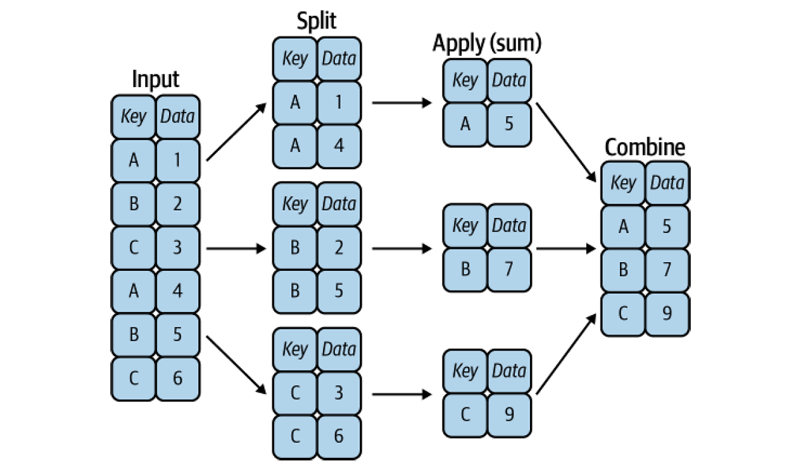

# 2.2. Data Manipulation with Pandas

## Data Transformation

Data transformation is the process of converting data from one format or structure to another. It is a fundamental aspect of most data integration and data management tasks, such as data wrangling and data warehousing.

### Merging, Joining, and Concatenating DataFrames

Pandas provides various facilities for easily combining together Series or DataFrame objects.

- **`concat()`**: Appends one or more DataFrames.
- **`merge()`**: Joins two DataFrames in a database-style join.

#### `concat()`

**Example: Concatenating two Series**
```python
ser1 = pd.Series(['A', 'B', 'C'], index=[1, 2, 3])
ser2 = pd.Series(['D', 'E', 'F'], index=[4, 5, 6])
result = pd.concat([ser1, ser2])
print(result)
```
**Output:**
```
1    A
2    B
3    C
4    D
5    E
6    F
dtype: object
```

**Example: Concatenating two DataFrames**

```python
df1 = pd.DataFrame({'A': ['A0', 'A1'], 'B': ['B0', 'B1']})
df2 = pd.DataFrame({'A': ['A2', 'A3'], 'B': ['B2', 'B3']})

result = pd.concat([df1, df2]) # rows i.e. axis=0 by default
print(result)
```

**Output:**
```
    A   B
0  A0  B0
1  A1  B1
0  A2  B2
1  A3  B3
```

```python
result = pd.concat([df1, df2], axis='columns') # or axis=1
print(result)
```

**Output:**
```
    A   B   A   B
0  A0  B0  A2  B2
1  A1  B1  A3  B3
```

```python
result = pd.concat([df1, df2], ignore_index=True) 
print(result)
```

**Output:**
```
   A   B
0  A0  B0
1  A1  B1
2  A2  B2
3  A3  B3
```

```python
result = pd.concat([df1, df2], keys=['X', 'Y']) 
print(result)
```

**Output:**
```
      A   B
X 0  A0  B0
  1  A1  B1
Y 0  A2  B2
  1  A3  B3
```

> **Note:** There is also the `append` method that does similar job.
> ```python
> df1.append(df2)
> ```

#### `merge()`

`merge()` is the function used to join two DataFrames horizontally. A common column is used to align the rows in the two DataFrames.

**Example: Merging two DataFrames**

```python
left = pd.DataFrame({'key': ['K0', 'K1'], 'A': ['A0', 'A1']})
right = pd.DataFrame({'key': ['K0', 'K1'], 'B': ['B0', 'B1']})

result = pd.merge(left, right, on='key')
print(result)
```

**Output:**
```
  key   A   B
0  K0  A0  B0
1  K1  A1  B1
```

#### Categories of Joins

Merging two DataFrames on a common column is a common operation, called join in SQL. Categorically joins can be of the following types:
- One-to-one: Each row in the left DataFrame matches exactly one row in the right DataFrame. This happens when the key columns are unique in both DataFrames.
- One-to-many/many-to-one: Each row in the left DataFrame matches one or more rows in the right DataFrame, and vice versa. This happens when one of the to key columns contains duplicate values.
- Many-to-many: If the key columns are not unique in both DataFrames, the merge will result in a many-to-many join.

**Example: One-to-one join**
```python
df1 = pd.DataFrame({
    'employee': ['Bob', 'Jake', 'Lisa', 'Sue'],
    'group': ['Accounting', 'Engineering','Engineering', 'HR']})
df2 = pd.DataFrame({
    'employee': ['Lisa', 'Bob', 'Jake', 'Sue'],
    'hire_date': [2004, 2008, 2012, 2014]})

df3 = pd.merge(df1, df2, on='employee')
print(df3)
```

**Output:**
```
  employee        group  hire_date
0      Bob   Accounting       2008
1     Jake  Engineering       2012
2     Lisa  Engineering       2004
3      Sue           HR       2014
```

**Example: One-to-many join**
```python
df4 = pd.DataFrame({
    'group': ['Accounting', 'Engineering', 'HR'],
    'supervisor': ['Carly', 'Guido', 'Steve']})
print(pd.merge(df3, df4, on='group'))
```

**Output:**
```
  employee        group  hire_date supervisor
0      Bob   Accounting       2008      Carly
1     Jake  Engineering       2012      Guido
2     Lisa  Engineering       2004      Guido
3      Sue           HR       2014      Steve
```

**Example: Many-to-many join**
```python
df5 = pd.DataFrame({
    'group': ['Accounting', 'Accounting','Engineering', 'Engineering', 'HR', 'HR'],
    'skills': ['math', 'spreadsheets', 'software', 'math', 'spreadsheets', 'organization']})
print(pd.merge(df1, df5, on='group'))
```

**Output:**
```
    employee   group    skills
0   Bob   Accounting    math
1   Bob   Accounting    spreadsheets
2   Jake  Engineering   software
3   Jake  Engineering   math
4   Lisa  Engineering   software
5   Lisa  Engineering   math
6   Sue   HR            spreadsheets
7   Sue   HR            organization
```

#### Merging on Different Keys

When you want to merge two DataFrames on different columns, you can use the `left_on` and `right_on` parameters.
```python
df3 = pd.DataFrame({
    'name': ['Bob', 'Jake', 'Lisa', 'Sue'],
    'salary': [70000, 80000, 120000, 90000]
})
pd.merge(df1, df3, left_on="employee", right_on="name")
```

**Output:**
```
  employee        group  name  salary
0      Bob   Accounting   Bob   70000
1     Jake  Engineering  Jake   80000
2     Lisa  Engineering  Lisa  120000
3      Sue           HR   Sue   90000
```

> **Note:** This process results in a redundant column "name" in the resulting DataFrame. You can drop it using the `.drop('name', axis=1)`.

Sometimes, rather than merging on a column, you would instead like to merge on an index.
```python
df1a = df1.set_index('employee')
df2a = df2.set_index('name')
pd.merge(df1a, df2a, left_index=True, right_index=True)
```
**Output:**
```
                group  hire_date
employee                        
Bob        Accounting       2008
Jake      Engineering       2012
Lisa      Engineering       2004
Sue                HR       2014
```

> **Note:** Pandas includes a method called `join` that is a convenient wrapper for `merge` that defaults to using the index as the key.
> ```python
> df1a.join(df2a)
> ```

#### Set Arithmetic for Joins

What happens when a value appears in one key column but not the other? This is a common problem when merging DataFrames. There are several ways to handle this situation.
- `inner` join: This is the default join type. It returns only the rows that have matching values in both DataFrames.
- `outer` join: This returns all rows from both DataFrames, and fills in the missing values with `NaN`.
- `left` join: This returns all rows from the left DataFrame, and fills in the missing values with `NaN`.
- `right` join: This returns all rows from the right DataFrame, and fills in the missing values with `NaN`.

**Example: Inner join**
```python
df6 = pd.DataFrame({
    'name': ['Peter', 'Paul', 'Mary'],
    'food': ['fish', 'beans', 'bread']},
    columns=['name', 'food'])
df7 = pd.DataFrame({
    'name': ['Mary', 'Joseph'],
    'drink': ['wine', 'beer']},
    columns=['name', 'drink'])
print(pd.merge(df6, df7)) # inner join by default, equivalent to how = 'inner'
```
**Output:**
```
   name   food drink
0  Mary  bread  wine
```

**Example: Outer join**
```python
print(pd.merge(df6, df7, how='outer'))
```
**Output:**
```
     name   food drink
0  Joseph    NaN  beer
1    Mary  bread  wine
2    Paul  beans   NaN
3   Peter   fish   NaN
```

**Example: Left join**
```python
print(pd.merge(df6, df7, how='left'))
```
**Output:**
```
    name   food drink
0  Peter   fish   NaN
1   Paul  beans   NaN
2   Mary  bread  wine
```

**Example: Right join**
```python
print(pd.merge(df6, df7, how='right'))
```
**Output:**
```
     name   food drink
0    Mary  bread  wine
1  Joseph    NaN  beer
```

**Example: Cross join**
```python
print(pd.merge(df6, df7, how='cross'))
```
**Output:**
```
  name_x   food  name_y drink
0  Peter   fish    Mary  wine
1  Peter   fish  Joseph  beer
2   Paul  beans    Mary  wine
3   Paul  beans  Joseph  beer
4   Mary  bread    Mary  wine
5   Mary  bread  Joseph  beer
```

#### Overlapping Column Names

When two DataFrames have overlapping column names, you can use the `prefix` parameter to add a prefix to the overlapping column names.
```python
df8 = pd.DataFrame({'name': ['Bob', 'Jake', 'Lisa', 'Sue'],
'rank': [1, 2, 3, 4]})
df9 = pd.DataFrame({'name': ['Bob', 'Jake', 'Lisa', 'Sue'],
'rank': [3, 1, 4, 2]})
pd.merge(df8, df9, on="name", suffixes=["_L", "_R"])
```

**Output:**
```
  name  rank_L  rank_R
0   Bob       1       3
1  Jake       2       1
2  Lisa       3       4
3   Sue       4       2
```

### Aggregating and Grouping Data

**Example:**
```python
import seaborn as sns
planets = sns.load_dataset('planets')
print(planets.head())
```

**Output:**
```
            method  number  orbital_period   mass  distance  year
0  Radial Velocity       1         269.300   7.10     77.40  2006
1  Radial Velocity       1         874.774   2.21     56.95  2008
2  Radial Velocity       1         763.000   2.60     19.84  2011
3  Radial Velocity       1         326.030  19.40    110.62  2007
4  Radial Velocity       1         516.220  10.50    119.47  2009
```

Simple aggregation examples are `mean`, `max`, `min`, `sum`, `count`, etc. Most of these methods have a axis parameter that can be set to 0 or 1 (or 'index' or 'columns') to specify the axis along which the operation is performed. By default, axis=0 (row-wise). In addition, there is a convenience method, `describe`, that computes several common aggregates for each column and returns the result.

```python
planets.dropna().describe()
```

**Output:**
```
          number  orbital_period        mass    distance         year
count  498.00000      498.000000  498.000000  498.000000   498.000000
mean     1.73494      835.778671    2.509320   52.068213  2007.377510
std      1.17572     1469.128259    3.636274   46.596041     4.167284
min      1.00000        1.328300    0.003600    1.350000  1989.000000
25%      1.00000       38.272250    0.212500   24.497500  2005.000000
50%      1.00000      357.000000    1.245000   39.940000  2009.000000
75%      2.00000      999.600000    2.867500   59.332500  2011.000000
max      6.00000    17337.500000   25.000000  354.000000  2014.000000
```

Listing of Pandas aggregation methods: 

| **Aggregation** | **Returns** |
| --- | --- |
| `count` | Total number of items |
| `first`, `last` | First and last item |
| `mean`, `median` | Mean and median |
| `min`, `max` | Minimum and maximum |
| `std`, `var` | Standard deviation and variance |
| `mad` | Mean absolute deviation |
| `prod` | Product of all items |
| `sum` | Sum of all items |

The name “group by” comes from a command in the SQL database language, but it is perhaps more illuminative to think of it in the terms first coined by Hadley Wickham of Rstats fame: split, apply, combine.
- The split step involves breaking up and grouping a DataFrame depending on the value of the specified key.
- The apply step involves computing some function, usually an aggregate, transformation, or filtering, within the individual groups.
- The combine step merges the results of these operations into an output array.



```python
df = pd.DataFrame({
    'key': ['A', 'B', 'C', 'A', 'B', 'C'],
    'data': range(6)}, 
    columns=['key', 'data'])

print(df)
```

**Output:**
```
  key  data
0   A     0
1   B     1
2   C     2
3   A     3
4   B     4
5   C     5
```

```python
df.groupby('key').sum()
```

**Output:**
```
   data
key    
A     3
B     5
C     7
```

```python
planets.groupby('method')['orbital_period'].median()
```

**Output:**
```
method
Astrometry                      122.0
Imaging                         27500.000000
Microlensing                    3300.000000
Orbital Brightness Modulation   0.342887
Pulsar Timing                   66.541900
Pulsation Timing Variations     1170.000000
Radial Velocity                 360.200000
Transit                         5.714932
Transit Timing Variations       57.011000
Name: orbital_period, dtype: float64
```

The GroupBy object supports direct iteration over the groups, returning each group as a `Series` or `DataFrame`:

```python
for (method, group) in planets.groupby('method'):
    print(f"{method:30s} shape={group.shape}")
```

**Output:**
```
Astrometry                     shape=(2, 6)
Eclipse Timing Variations      shape=(9, 6)
Imaging                        shape=(38, 6)
Microlensing                   shape=(23, 6)
Orbital Brightness Modulation  shape=(3, 6)
Pulsar Timing                  shape=(5, 6)
Pulsation Timing Variations    shape=(1, 6)
Radial Velocity                shape=(553, 6)
Transit                        shape=(397, 6)
Transit Timing Variations      shape=(4, 6)
```

Any method not explicitly implemented by the GroupBy object will be passed through and called on the groups, whether they are DataFrame or Series objects.

```python
planets.groupby('method')['year'].describe()
```

**Output:**
```
                               count         mean       std     min      25%     50%      75%     max
method                                                                                                  
Astrometry                       2.0  2011.500000  2.121320  2010.0  2010.75  2011.5  2012.25  2013.0   
Eclipse Timing Variations        9.0  2010.000000  1.414214  2008.0  2009.00  2010.0  2011.00  2012.0   
Imaging                         38.0  2009.131579  2.781901  2004.0  2008.00  2009.0  2011.00  2013.0   
Microlensing                    23.0  2009.782609  2.859697  2004.0  2008.00  2010.0  2012.00  2013.0   
Orbital Brightness Modulation    3.0  2011.666667  1.154701  2011.0  2011.00  2011.0  2012.00  2013.0   
Pulsar Timing                    5.0  1998.400000  8.384510  1992.0  1992.00  1994.0  2003.00  2011.0   
Pulsation Timing Variations      1.0  2007.000000       NaN  2007.0  2007.00  2007.0  2007.00  2007.0   
Radial Velocity                553.0  2007.518987  4.249052  1989.0  2005.00  2009.0  2011.00  2014.0   
Transit                        397.0  2011.236776  2.077867  2002.0  2010.00  2012.0  2013.00  2014.0   
Transit Timing Variations        4.0  2012.500000  1.290994  2011.0  2011.75  2012.5  2013.25  2014.0 
```

### Aggregate, Filter, Transform, Apply
```python
rng = np.random.RandomState(0)
df = pd.DataFrame({
    'key': ['A', 'B', 'C', 'A', 'B', 'C'],
    'data1': range(6),
    'data2': rng.randint(0, 10, 6)},
    columns = ['key', 'data1', 'data2'])
print(df)
```

**Output:**
```
  key  data1  data2
0   A      0      5
1   B      1      0
2   C      2      3
3   A      3      3
4   B      4      7
5   C      5      9
```

The `aggregate` method can take a string, a function, or a list thereof, and compute all the aggregates at once.

```python
df.groupby('key').aggregate(['min', 'median', 'max'])
```

**Output:**
```
    data1            data2           
      min median max   min median max
key                                  
A       0    1.5   3     3    4.0   5
B       1    2.5   4     0    3.5   7
C       2    3.5   5     3    6.0   9
```

> **Note:** The `agg` method is an alias for `aggregate`.

```python
df.groupby('key').agg({'data1': 'min', 'data2': 'median'})
```

**Output:**
```
    data1  data2
key              
A       0    4.0
B       1    3.5
C       2    6.0
```

Another common use of aggregation is to apply different functions to different columns and rename the output.

```python
df.groupby('key').agg(
    dataX= ('data1', 'min'),
    dataY= ('data2', 'median')
)
```

**Output:**
```
    dataX  dataY
key              
A       0    4.0
B       1    3.5
C       2    6.0
```

A filtering operation allows you to drop data based on the group properties.

```python
def filter_func(x):
    return x['data2'].std() > 4

df.groupby('key').filter(filter_func)
```

**Output:**
```
  key  data1  data2
1   B      1      0
2   C      2      3
4   B      4      7
5   C      5      9
```

While aggregation must return a reduced version of the data, transformation can return some transformed version of the full data to recombine. For such a transformation, the output is the same shape as the input.

```python
def center(x):
    return x - x.mean()
df.groupby('key').transform(center)
```

**Output:**
```
   data1  data2
0   -1.5    1.0
1   -1.5   -3.5
2   -1.5   -3.0
3    1.5   -1.0
4    1.5    3.5
5    1.5    3.0
```

The `apply` method lets you apply an arbitrary function to the group results.

```python
def norm_by_data2(x):
    # x is a DataFrame of group values
    x['data1'] /= x['data2'].sum()
    return x

df.groupby('key')[['data1', 'data2']].apply(norm_by_data2)
```

**Output:**
```
          data1  data2
key                   
A   0  0.000000      5
    3  0.375000      3
B   1  0.142857      0
    4  0.571429      7
C   2  0.166667      3
    5  0.416667      9
```

### Pivot Tables

Pandas provides a `pivot_table` function that can be used to create pivot tables from a DataFrame. Pivoting is a way to transform data by reorganizing it into a tabular format, usually by making one or more variables the index and another variable the column. This is often used to create summary statistics of data.

```python
titanic = sns.load_dataset('titanic')
```

**Output:**
```
   survived  pclass     sex   age  sibsp  parch     fare embarked  class      who  adult_male deck  embark_town alive  alone  
0         0       3    male  22.0      1      0   7.2500        S  Third      man        True  NaN  Southampton    no  False  
1         1       1  female  38.0      1      0  71.2833        C  First    woman       False    C    Cherbourg   yes  False  
2         1       3  female  26.0      0      0   7.9250        S  Third    woman       False  NaN  Southampton   yes   True  
3         1       1  female  35.0      1      0  53.1000        S  First    woman       False    C  Southampton   yes  False  
4         0       3    male  35.0      0      0   8.0500        S  Third      man        True  NaN  Southampton    no   True
```

```python
titanic.groupby('sex')[['survived']].mean()
```

**Output:**
```
        survived
sex             
female  0.742038
male    0.188908
```

```python
titanic.groupby(['sex', 'class'])['survived'].aggregate('mean')
```

**Output:**
```
sex     class 
female  First     0.968085
        Second    0.921053
        Third     0.500000
male    First     0.368852
        Second    0.157407
        Third     0.135447
Name: survived, dtype: float64
```

```python
titanic.groupby(['sex', 'class'])['survived'].aggregate('mean').unstack()
```

**Output:**
```
class      First    Second     Third
sex                                 
female  0.968085  0.921053  0.500000
male    0.368852  0.157407  0.135447
```

Here is the equivalent to the preceding operation using the `DataFrame.pivot_table` method:

```python
titanic.pivot_table('survived', index='sex', columns='class', aggfunc='mean')
```

**Output:**
```
class      First    Second     Third
sex                                 
female  0.968085  0.921053  0.500000
male    0.368852  0.157407  0.135447
```

```python
titanic.pivot_table('survived', index='sex', columns='class', margins=True)
```

**Output:**
```
class      First    Second     Third       All
sex                                           
female  0.968085  0.921053  0.500000  0.742038
male    0.368852  0.157407  0.135447  0.188908
All     0.629630  0.472826  0.242363  0.383838
```

```python
titanic.pivot_table('survived', ['sex', 'sibsp'], 'class')
```

**Output:**
```
class            First    Second     Third
sex    sibsp                              
female 0      0.979592  0.931818  0.592593
       1      0.950000  0.892857  0.447368
       2      1.000000  1.000000  0.571429
       3      1.000000  1.000000  0.125000
       4           NaN       NaN  0.333333
       5           NaN       NaN  0.000000
       8           NaN       NaN  0.000000
male   0      0.329545  0.118421  0.129630
       1      0.483871  0.259259  0.222222
       2      0.500000  0.200000  0.125000
       3      0.000000       NaN  0.000000
       4           NaN       NaN  0.083333
       5           NaN       NaN  0.000000
       8           NaN       NaN  0.000000
```

```python
titanic.pivot_table(index='sex', columns='class', aggfunc={'survived':sum, 'fare':'mean'})
```

**Output:**
```
              fare                          survived             
class        First     Second      Third    First Second Third
sex                                                           
female  106.125798  21.970121  16.118810       91     70    72
male     67.226127  19.741782  12.661633       45     17    47
```
